# Kobra Max 1 Compiling Firmware Tutorial and Diagnosis

## Background and Diagnosing process
 
Recently I bought an Anycubic Kobra Max 1 for $150 (my first printer). The hotend it orginally came with was no good. it was leaking filament out the top. But after replacing it I stumbled onto the problem:

*```hotend heater abnormal please check it and wiring```*

So normally I checked the wires testing for continuity, which was okay.

I tested the new hotends on a bench power supply that my work had and they heated up fine.
The hotends measured ~ 13.5&#937; and 15&#937; which according to google is around what is expected for the 24v system.

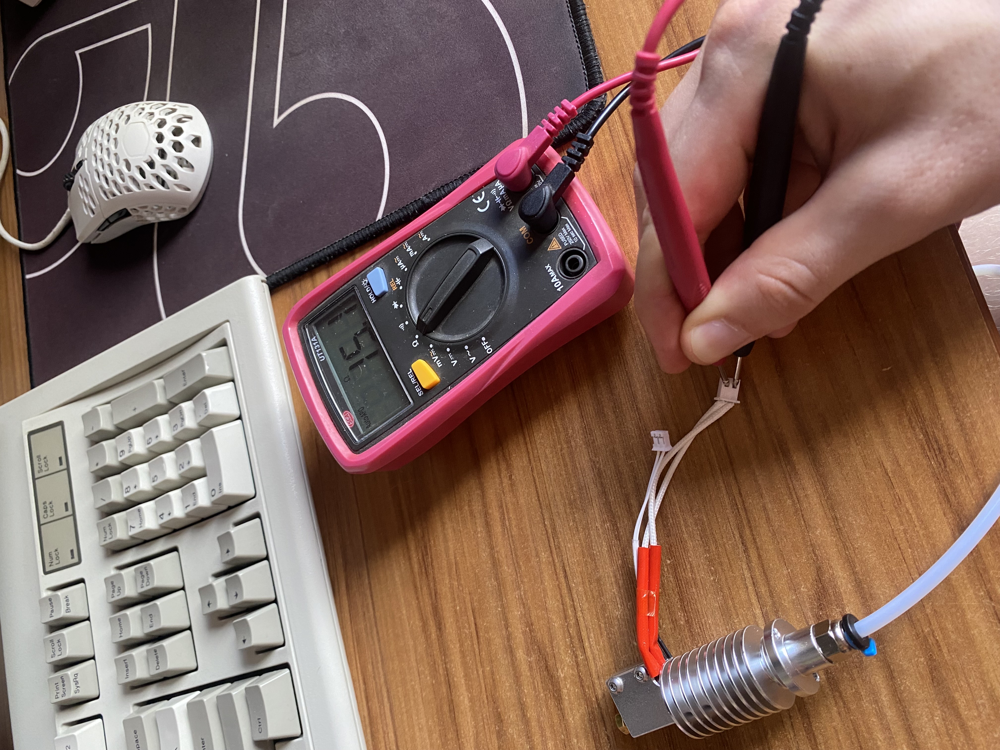

Next I turned my attention to the mosfets suspecting them to be toasted.

The mosfets on the `trigorilla pro a v1.0.4` are N channel, whatever that means.


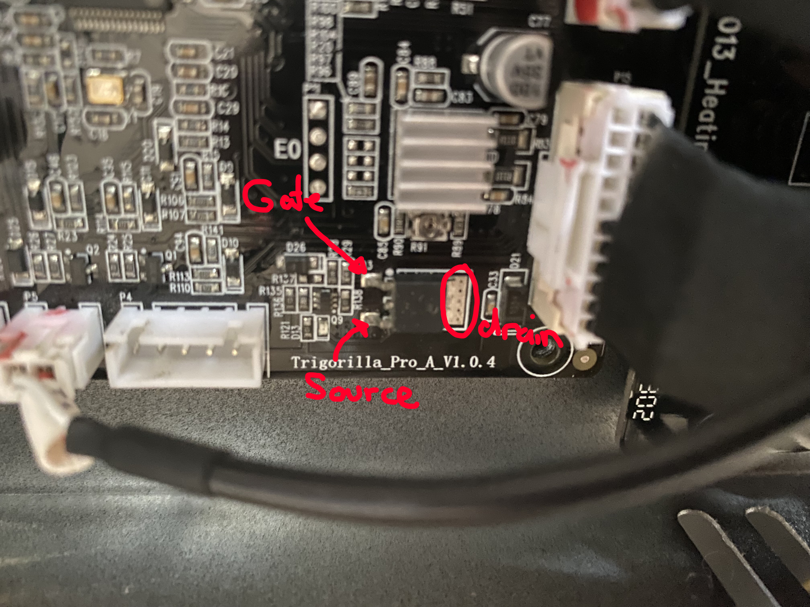

My understanding of a mosfet is that they use a smaller power source to switch on a larger power source

so the smaller power source is applied to the `Gate` which allows the larger power source to flow through `source` and `drain`.


- There is a funny design decision with the Kobra Max. It uses an external mosfet for the bed heating. But they are the extact same mosfet on both boards (`WSK220N04`). Strange. so the output of the first mosfet is used for the gate of the second mosfet. This is something you might see if you were trying to wire in an external mosfet yourself.


After **VERY** carefully probing the `gate` on the `ME60N03` mosfet for the heater while the printer is on and the temp is set (be careful not to short any pins). To my dismay, I saw no change in voltage.

I also checked the hotbed mosfets (`WSK220N04`) x 2. which while heating the bed showed around 10v at the Gate leg.

If the mosfet for the heater was toasted my plan would've been to wire in an external mosfet with a jumper wire soldered to the gate leg of the broken mosfet. But alas shit was more broken than I hoped

(╯°□°)╯︵ ┻━┻

^ Me

So at this point I start researching aftermarket board replacements (An original replacement is almost impossible to come by now), The BIGTREETECH mini e3 v3 looks good and hopefully sometime in the future I can swap it over to it. But that requires money and lots of time.

Or I can try getting switching the pin that is used for the heater 

## Compiling and modifying Anycubic Firmware
#### *If any of these files aren't available anymore please contact me*

This part is based off of this amazing reddit post:

[How to build anycubic marlin source code by jojos38](https://www.reddit.com/r/anycubic/comments/y2waxu/tutorial_how_to_build_anycubic_marlin_source_code/?utm_source=share&utm_medium=web2x&context=3) - No clue how he figured this out.

I will go over the same process here and talk about some issues I ran into and how to solve them.

You will need to download [Keil v5.36](https://armkeil.blob.core.windows.net/eval/MDK536.EXE) **Not a newer version!**

If you already have Keil downloaded you might run into some issues when trying to compile. It's best to start fresh if you're not familiar with any of this. unistall keil in `control panel > unistall a program` and also delete any files you might have in `C:\Users\<username>\AppData\Local\Arm` I had to do this because I tried compiling the source code on my own before I found the reddit post.

Double click the download to install once it has downloaded.


The pack installer will open and install default packages. Once that has finished you can then move on to installing the packages we will need.

in the Pack tab on the right, find and install `ARM::CMSIS 5.7.0` and unistall `5.8.0`

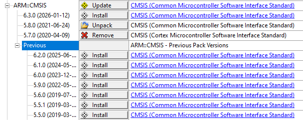

The only one you will need is `5.7.0`

Next you will need [HDSC.HC32F460 v1.0.7](https://1drv.ms/u/s!Ak69-GxOpF6Pg9gV3zWT5AIJPEan9g?e=ipQaD7) 


Double click and install it

Now we can close `Pack installer` and open `Keil µVision 5`

We now need a license that lets us use this toolchain

`File` > `License Management`

Click `Get LIC via Internet`.. and click `OK`

Now for `Product Serial # (PSN)`

we have the choose of either
 - 42B2L-JM9GY-LHN8C
 - 4RMW3-A8FIW-TUBLG

For kobra Max (and some other printers) use `42B2L-JM9GY-LHN8C` otherwise Keil with have no clue about your device.

If you're using a different printer use `4RMW3-A8FIW-TUBLG` first and try the other if you run into 

`Error: *** Project 'anycubic', Target 'firmware_Release', Device 'HDSC::HC32F460KETA' is not supported by Toolchain ! ***.`

This happened to me, I used `4RMW3-A8FIW-TUBLG` and ran into that error.

For the other details

Just fill in

- PC description
- First Name 
- Last Name
- Email
- Country
- phone

Make sure email is correct because you will be sent you code through it.

Press `Submit`

You should recieve an email containing your `License ID Code (LIC)`

Paste the LIC into `New License ID Code (LIC)` and press `Add LIC`

Now we need the [source code](https://github.com/ANYCUBIC-3D/Kobra_Max) for the Kobra Max.

Clone the files from `github`

next in `Keil µVision 5` go to `Project` > `Open Project`

find the anycubic.uvprojx file in `workspace/anycubic.uvprojx`

you can then press `F7` or `Project` > `Build target` to compile the binary

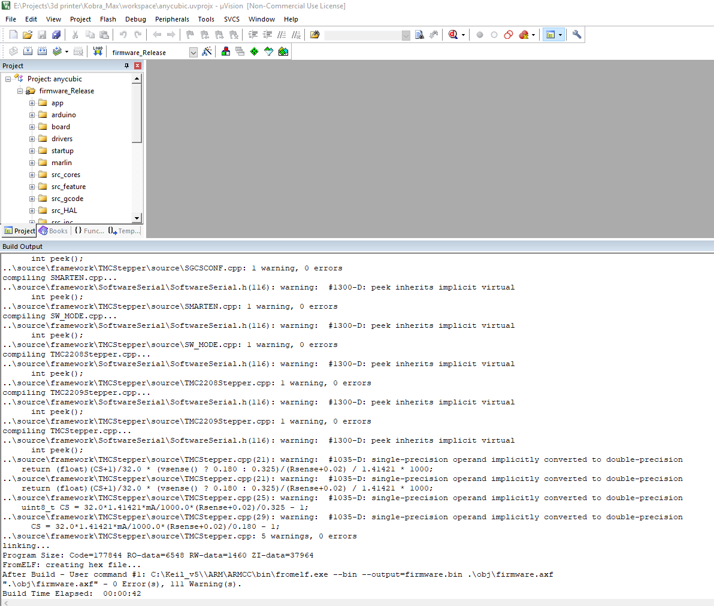

There Will be a lot of Warnings during compile, but don't freak out. As long as there are no Errors its all good. If you have errors feel free to freak out and perhaps try all this again from scratch.

If successful the binary will be in `workspace/firmware.bin` 

If you get any issues try the other `PSN` code provided

Your `Project` > `Options for Target 'firware_Release'` Device tab should look similar to this if the PSN code is working.

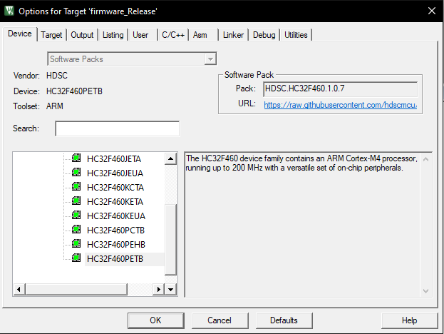

If you have a succesful Compile then you can move onto flashing the firmware

## Flashing Kobra Max Firmware 

```Motherboard firmware update steps:

Update steps:
1. Format the SD card, copy the motherboard firmware (firmware.bin) to the root directory of the SD card, and store only this file in the SD card.
2. Insert the SD card into the printer in the shutdown state, and then turn on the printer.
3. After a while, the printer will automatically update the firmware.
4. After the update is complete, the screen will automatically enter the main interface. Then shut down, and then pull out the SD card. update completed.
5. Power on, click "System" > "About" > "Firmware Version" to confirm the firmware version.

Troubleshooting method:

   If it stays on the blue screen for a long time, no animation is played. It is very likely that there is a problem with the formatting of the Micro SD card. Please reformat, note: formatted as fat32, the allocation unit size must be 4096 bytes
```

## Modifying the Source Code

Now that we can compile the source code we can now mess around with it.

My idea is to switch the bed heating and hotend heating around

I have very limited knowledge when it comes to C programming. But I do have a PHD in trial and error.

open up the code in your IDE of choice. I chose vscode since I'm not cool enough to use anything else.

After using Ctrl+F Search to find where the PINs are defined

I did a lil tweaking swapping the pins for heater and hotbed.

`source/Marlin/pins/stm32f1/pins_AC_TRI_F1_V1.h`
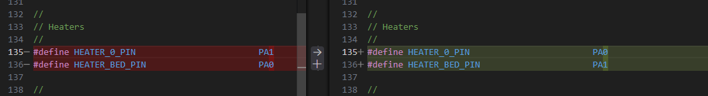
 
`source/board/bsp_init.h`
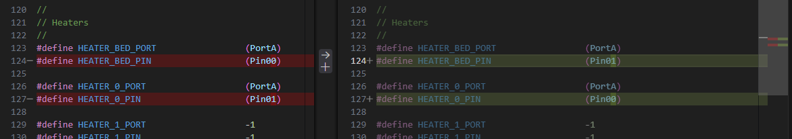

I compiled and flashed the new firmware.

But now I need to wire the heater to the hotbed output.

## Rewiring the heater

After this I took the output for the hotbed and put into my own wires

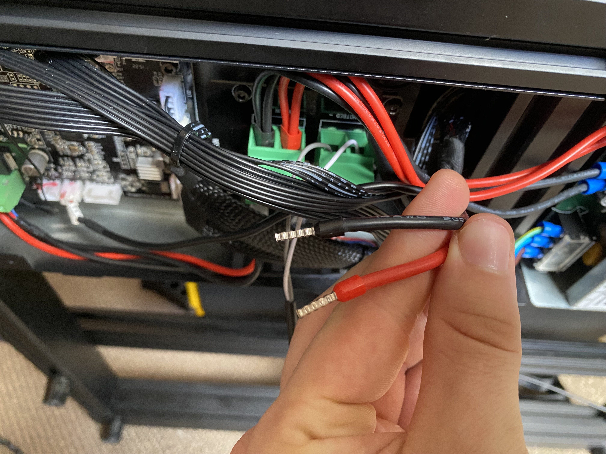

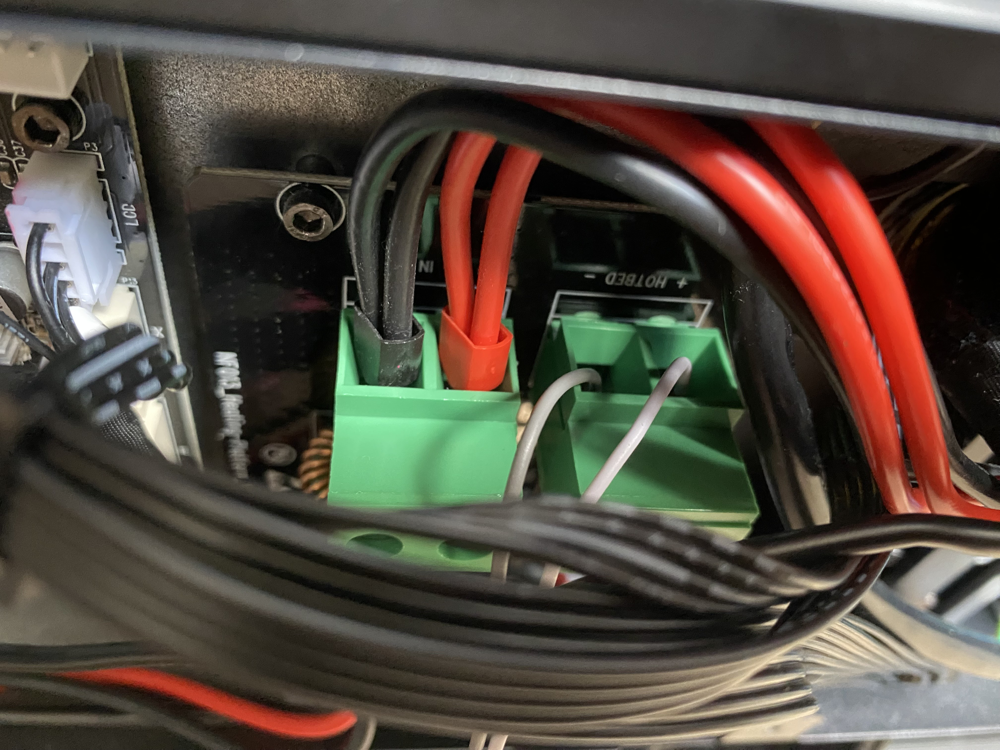

I then tied those wires directly to the hotend so I can test my changes. 

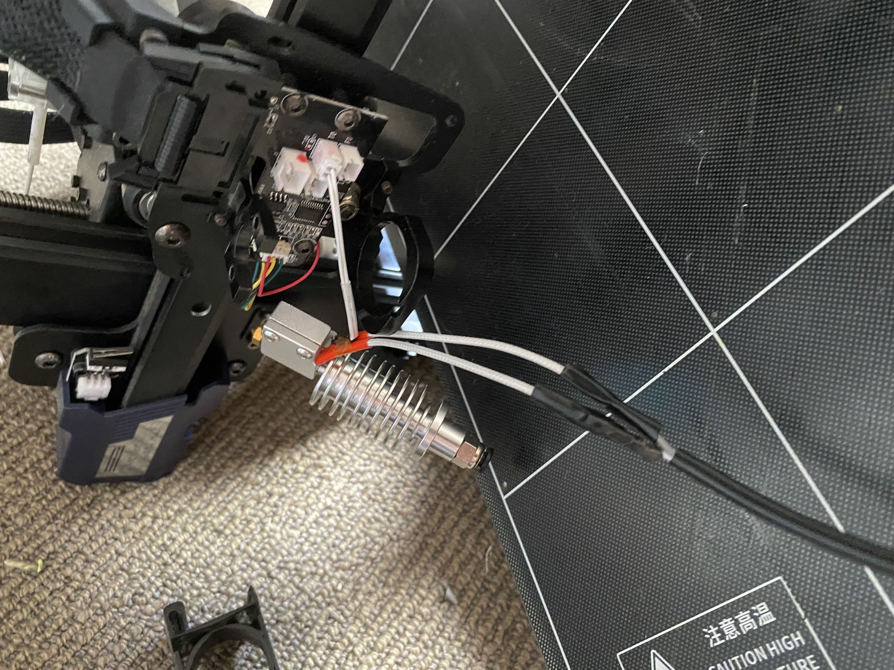

The temperature sensor still needs to be plugged in otherwise you will run into a whole different set of issues.

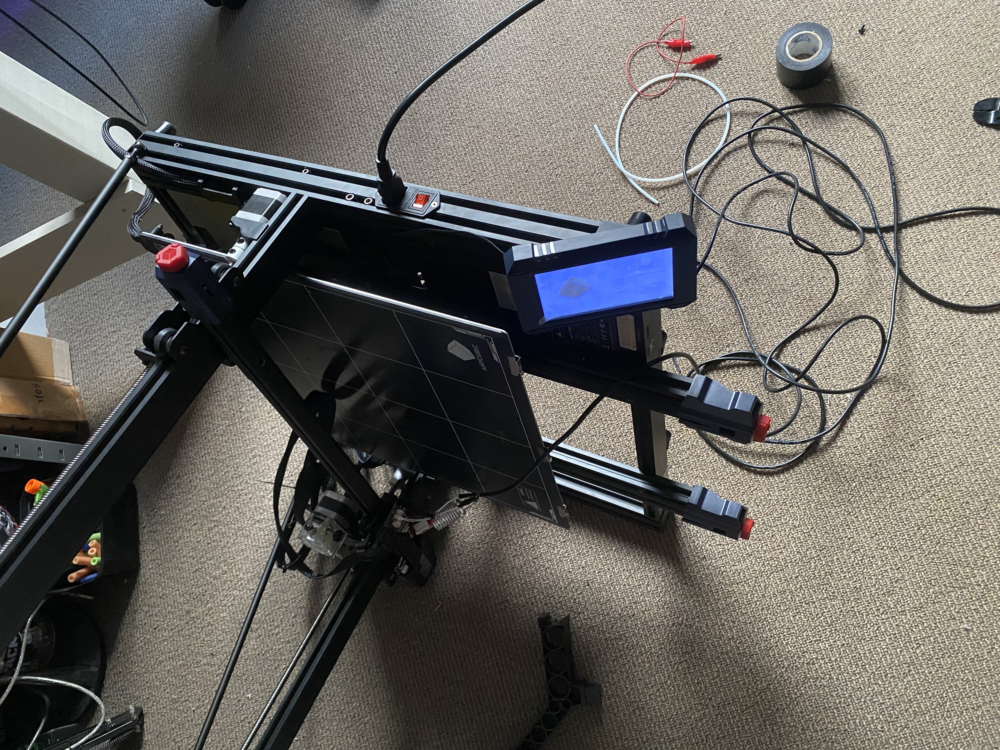

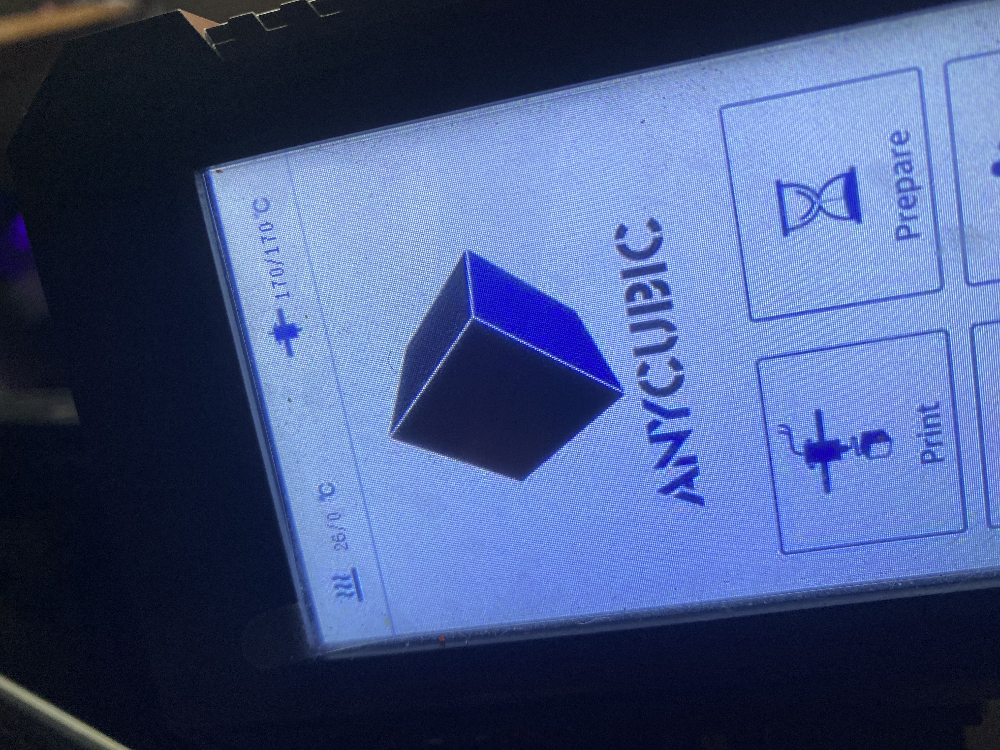

I would like to try see if I can set an unused GPIO pin as sort of new Gate that I can use for an external mosfet

But this is hard without a board diagram and my very limited knowledge of this field.

In the near future I would like to update this printer to use the BIGTREETECH mini e3 v3 and klipper which I will also do a write up about.